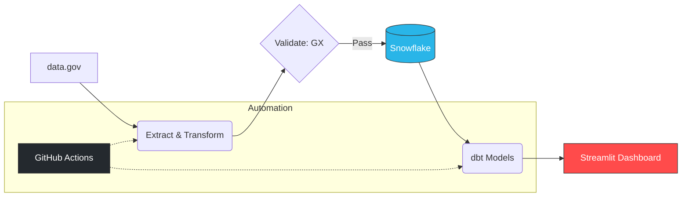

# ETL Pipeline Testing

This project is a cloud-based ETL pipeline for **FDA FAERS datasets** , built in GitHub Codespaces and powered by Snowflake for high-performance warehousing.
Instead of traditional cloud providers (AWS/Azure/GCP), this setup runs on the GitHub ecosystem to manage the full lifecycle: from code execution in a cloud container (Codespaces) to automated testing and deployment (GitHub Actions). It extracts quarterly raw TXT files, transforms and validates them using **Python, dbt, and Great Expectations**, and loads cleaned tables into Snowflake.  

A **Snowflake-native Streamlit dashboard** is included to show in-warehouse visualizations. Only a small set of validated metrics is displayed to ensure accuracy and avoid heavy queries.

---

## Workflow

1. Extract raw FAERS TXT files.  
2. Transform and merge files into structured CSVs.
3. Unit Test code logic with pytest to handle empty files or missing columns safely.
4. Validate processed data using **Great Expectations**.  
5. Optionally load cleaned tables to Snowflake (requires credentials).  
6. Run dbt models and tests locally.  
7. CI/CD ensures automated testing and reproducibility.

## CI/CD – GitHub Actions

---

## Engineering Highlights

- Processed **11.5M+ rows** from FAERS datasets using chunked loading to avoid memory issues.  
- End-to-end workflow (extract → transform → validate → load → dbt models/tests) completed in ~15 minutes with **23 dbt models** and **58 tests**.  
- Pipeline runs securely without storing credentials in code.
- Integrated Great Expectations to catch schema drifts before loading to Snowflake.

## Great Expectations Validation in Codespaces

---

## Testing & Validation

- **Great Expectations** validates row counts and expected columns.  
- dbt tests check for duplicates, nulls, and accepted values.  
- Example: `clean_fda_demo` flagged 131 duplicate `primaryid + caseversion` combinations out of 11.5M rows.  
- Unit tests implemented with **pytest** to cover Extract, Transform, and Load stages.
- CI/CD via GitHub Actions to automate the full pipeline on every commit

> Note: For demonstration, nulls in staging tables are preserved. In production, these would be handled according to business rules.

## dbt DAG Lineage Graph

---

## Streamlit Dashboard

A Snowflake-native **Streamlit dashboard** demonstrates interactive visualizations of FAERS data for top antidepressants:

- **Drugs included:** SERTRALINE, FLUOXETINE, CITALOPRAM, ESCITALOPRAM, VENLAFAXINE, DULOXETINE, BUPROPION, TRAZODONE, AMITRIPTYLINE  
- **Time period:** 2025 Q1–Q2 (6 months of data)  
- **Outcomes highlighted:** Death (DE), Life-Threatening (LT), Hospitalization (HO), Disability (DS)  
- Multi-tab, multi-color bar charts for clear distinction  
- Raw data tables displayed below charts for context and verification  

This lightweight demo showcases **in-warehouse analytics** using Snowflake’s Streamlit integration without heavy queries.

## Analytics Layer – Streamlit Dashboard

---

## Screenshots

  

- Additional screenshots show pipeline execution, data transformations, and test results.  
- No credentials or cloud access are required to view results.

---

